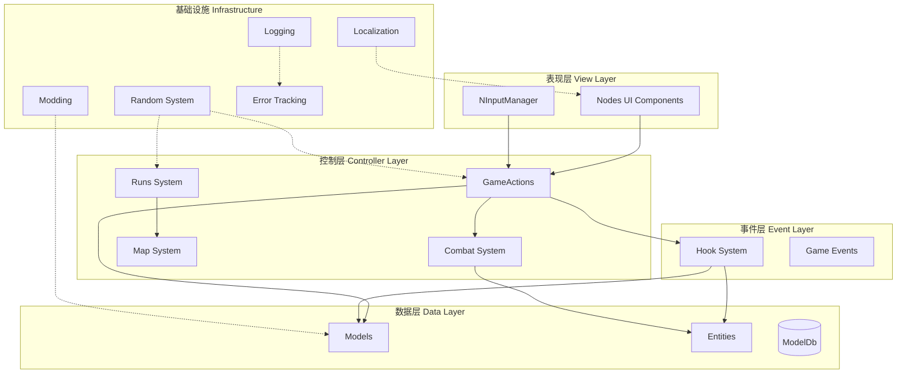
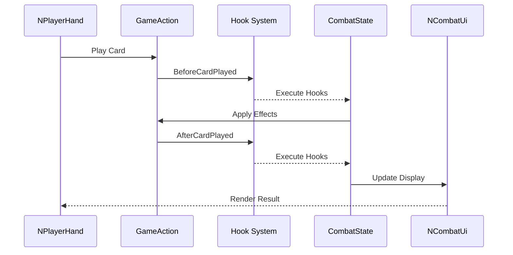
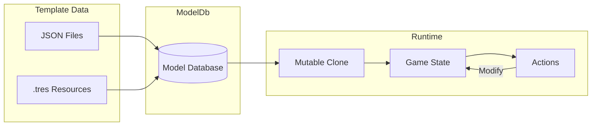
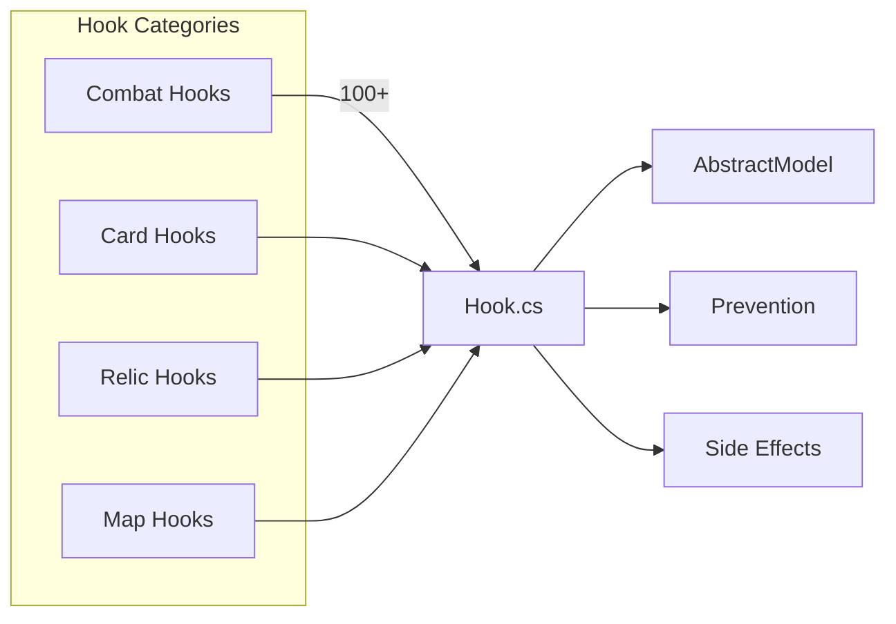
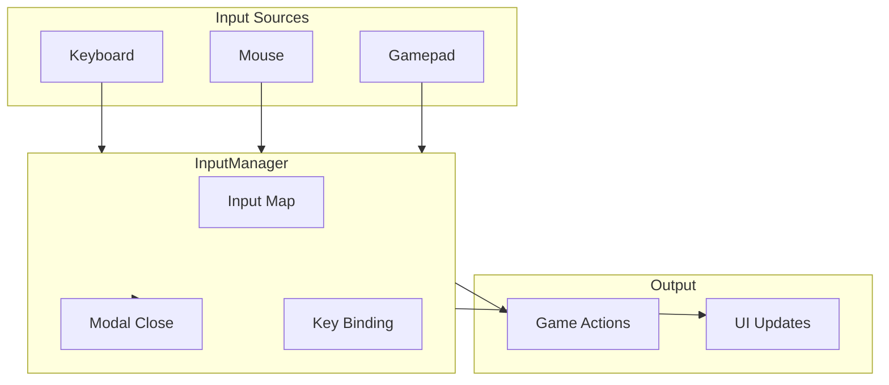
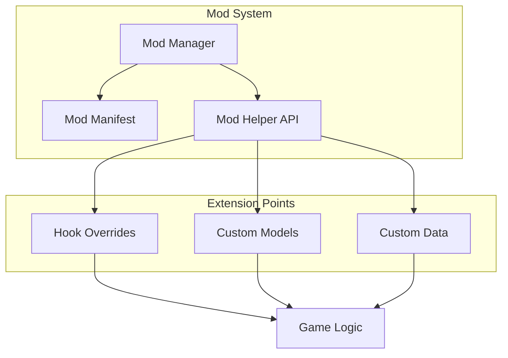

# Slay the Spire 2 架构框架文档

  

## 1. 采用的架构模式

  

本项目采用以下核心架构模式：

  

### 1.1 分层架构 (Layered Architecture)

项目采用严格的三层架构：

- **表现层 (View Layer)**: `src/Core/Nodes/` - 所有Godot节点类，负责UI渲染和用户交互

- **控制层 (Controller Layer)**: `src/Core/GameActions/`, `src/Core/Combat/`, `src/Core/Runs/` - 游戏逻辑控制

- **数据层 (Data Layer)**: `src/Core/Models/`, `src/Core/Entities/` - 数据模型和业务逻辑

  

### 1.2 事件驱动架构 (Event-Driven / Hook System)

- 使用静态类 `Hook` 作为全局事件总线 (`src/Core/Hooks/Hook.cs`)

- 涵盖战斗、卡牌、遗物、状态等100+个钩子点

- 所有游戏逻辑通过Hook进行解耦

  

### 1.3 命令模式 (Command Pattern)

- `GameAction` 基类实现所有可执行操作 (`src/Core/GameActions/GameAction.cs`)

- 支持撤销、队列执行、多人同步

  

### 1.4 数据驱动设计 (Data-Driven Design)

- `AbstractModel` 作为所有游戏实体基类 (`src/Core/Models/AbstractModel.cs`)

- 运行时使用可变克隆(Mutable Clone)，原始模板保持不变

  

### 1.5 状态机模式 (State Machine)

- 卡牌交互使用状态机 (`CardPlay` 相关类)

- 战斗状态管理 (`CombatState`)

  

---

  

## 2. 架构职责

  

### 2.1 Nodes层 (表现层)

- 负责UI渲染和用户输入捕获

- 所有类以 `N` 前缀命名 (如 `NCard`, `NCombatUi`)

- 不直接修改游戏数据，只发出动作请求

  

### 2.2 Models层 (数据层)

- 定义游戏实体数据模型

- 包含卡牌、遗物、法术、怪物等数据模板

- 支持不可变(Canonical)和可变(Mutable)两种状态

  

### 2.3 GameActions层 (控制层)

- 处理所有游戏动作的执行

- 支持异步执行和玩家决策暂停

- 包含网络同步版本用于多人游戏

  

### 2.4 Hooks层 (事件层)

- 提供100+个扩展点

- 允许mod和技能在特定时机插入逻辑

- 支持阻止默认行为

  

---

  

## 3. 分层方式

  

```

src/Core/

├── Nodes/              # 表现层 - Godot节点 (View)

│   ├── Combat/        # 战斗UI

│   ├── Cards/         # 卡牌UI

│   ├── Relics/        # 遗物UI

│   ├── Rooms/         # 房间场景

│   └── CommonUi/      # 通用UI组件

│

├── Models/             # 数据层 - 实体模板 (Data)

│   ├── CardModel.cs

│   ├── RelicModel.cs

│   ├── PowerModel.cs

│   └── ...

│

├── Entities/          # 实体运行时状态 (Runtime State)

│   ├── Cards/

│   ├── Creatures/

│   └── Players/

│

├── GameActions/       # 控制层 - 动作执行 (Controller)

│   ├── PlayCardAction.cs

│   ├── EndPlayerTurnAction.cs

│   └── ...

│

├── Hooks/             # 事件层 - 钩子系统 (Events)

│   └── Hook.cs        # 100+个静态钩子方法

│

├── Combat/            # 战斗逻辑

├── Runs/              # 肉鸽Run状态管理

├── Map/               # 地图生成

├── Rooms/             # 房间逻辑

├── Modding/           # Mod支持系统

├── Localization/      # 本地化

└── Random/            # 随机数管理

```

  

---

  

## 4. 分层职责

  

### 4.1 表现层 (Nodes)

- **职责**: UI渲染、用户输入捕获、动画播放

- **边界**: 禁止直接修改Model数据，只通过GameAction与后端通信

- **通信**: 通过信号(Signals)和回调与控制层交互

  

### 4.2 数据层 (Models/Entities)

- **职责**: 定义游戏数据模板、管理运行时状态

- **边界**: 不涉及UI逻辑，只负责数据结构和计算

- **模板 vs 实例**: 严格区分 canonical(模板) 和 mutable(运行时实例)

  

### 4.3 控制层 (GameActions)

- **职责**: 动作执行、状态流转、权限验证

- **边界**: 编排多个Hook调用，管理动作队列

- **异步**: 支持玩家决策时暂停动作执行

  

### 4.4 事件层 (Hooks)

- **职责**: 提供扩展点、解耦业务逻辑

- **边界**: 纯逻辑处理，不涉及UI

- **设计**: 每个Hook方法对应一个游戏时机

  

---

  

## 5. 可扩展性以及Mod实现方式

  

### 5.1 Mod架构

项目内置完整的Mod支持系统：

  

```

src/Core/Modding/

├── ModManager.cs      # Mod加载和管理

├── ModManifest.cs     # Mod清单定义

├── ModHelper.cs       # Mod辅助API

├── Mod.cs            # Mod基类

└── ModSettings.cs    # Mod设置

```

  

### 5.2 Hook扩展机制

```csharp

// Hook.cs 静态类提供100+扩展点

public static class Hook

{

    public static async Task BeforeAttack(CombatState combatState, AttackCommand command);

    public static async Task AfterCardPlayed(CombatState combatState, CardModel card);

    public static async Task OnEnemyDeath(CombatState combatState, Creature creature);

    // ... 100+ 更多

}

```

  

### 5.3 AbstractModel可扩展性

- 所有游戏实体继承 `AbstractModel`

- 通过重写hook方法添加自定义逻辑

- 支持运行时动态添加/移除效果

  

### 5.4 数据文件扩展

- 卡牌、遗物、怪物等数据通过JSON/资源文件定义

- Mod可以添加新的数据文件

  

---

  

## 6. 耦合程度以及解耦方式

  

### 6.1 主要解耦手段

  

#### 6.1.1 事件总线 (Hook System)

```csharp

// 不直接引用，通过Hook解耦

await Hook.BeforeAttack(combatState, command);

// 各个模块独立监听

```

  

#### 6.1.2 依赖注入

- 节点通过 `@onready` 和 `@export` 获取依赖

- 避免硬编码路径引用

  

#### 6.1.3 接口抽象

- `IRunState`, `ICombatState` 等接口

- 多人模式下可以替换实现

  

### 6.2 耦合风险点

- `NInputManager` 集中处理输入，可能耦合较重

- `CombatState` 包含大量游戏状态，耦合度较高

- Nodes层对GameAction的具体类型有一定依赖

  

### 6.3 解耦改进建议

- 进一步抽象GameAction类型

- 使用事件聚合器替代直接引用

  

---

  

## 7. 内聚程度

  

### 7.1 高内聚模块

- **Hooks**: 单一职责，纯逻辑处理

- **Random**: 随机数生成管理

- **Localization**: 本地化字符串管理

  

### 7.2 中内聚模块

- **GameActions**: 每个Action类内聚完整，但Action之间有协作

- **Combat**: 战斗逻辑内聚，但与多个系统交互

  

### 7.3 需要关注的模块

- **Nodes**: UI组件内聚，但与业务逻辑有一定耦合

- **Models**: 数据模型内聚，但子类众多

  

---

  

## 8. 依赖反转实现方式

  

### 8.1 接口抽象

```csharp

// IRunState - 运行状态接口

public interface IRunState

{

    RunRngSet RngSet { get; }

    List<RelicModel> Relics { get; }

    // ...

}

  

// 多人模式可以提供不同实现

public class RunState : IRunState { }

public class NullRunState : IRunState { }

```

  

### 8.2 依赖注入

```csharp

// 通过构造函数或属性注入

public class CombatRoom : AbstractRoom, ICombatRoomVisuals

{

    private IRunState _runState;

    public void SetRunState(IRunState runState) { ... }

}

```

  

### 8.3 抽象基类

```csharp

// AbstractModel 作为所有实体的抽象基类

public abstract class AbstractModel

{

    public abstract bool ShouldReceiveCombatHooks { get; }

    // hook方法默认实现

}

```

  

---

  

## 9. 资源加载方式

  

### 9.1 资源类型

- **静态资源**: 图片、音频、场景 - 通过Godot资源系统

- **数据资源**: 卡牌、遗物、怪物定义 - 通过 `ModelDb` 数据库

  

### 9.2 异步加载

```csharp

// PreloadManager.cs

public static async Task LoadRoomEventAssets(EventModel eventModel, IRunState runState)

```

  

### 9.3 资源预加载

- 战斗场景使用预加载策略

- 使用 `AtlasResourceLoader` 优化图集加载

  

---

  

## 10. Autoload单例分析

  

### 10.1 项目配置的单例

根据 `project.godot`:

  

| 单例名称 | 类型 | 用途 |

|---------|------|------|

| SentryInit | SentryInit.gd | 错误追踪和反馈 |

| OneTimeInitialization | Scene | 一次性初始化 |

| AssetLoader | Scene | 资源加载管理 |

| DevConsole | Scene | 调试控制台 |

| CommandHistory | Scene | 命令历史 |

| MemoryMonitor | Scene | 内存监控 |

| FmodManager | FmodManager.gd | FMOD音频管理 |

  

### 10.2 C# 单例模式

```csharp

// LocManager.cs

public static LocManager Instance { get; private set; } = null;

  

// Rng.cs  

public static Rng Chaotic { get; } = new Rng(...);

```

  

### 10.3 设计特点

- GDScript单例用于编辑器级功能

- C#单例用于核心游戏逻辑

- 使用 `Initialize()` 模式延迟初始化

  

---

  

## 11. 项目实际文件映射与分层注释

  

### 11.1 表现层 (View Layer) - `src/Core/Nodes/`

  

| 文件 | 分层 | 模式 |

|------|------|------|

| `NInputManager.cs` | 表现层 | 输入管理 |

| `NCard.cs` | 表现层 | 卡牌UI |

| `NCombatUi.cs` | 表现层 | 战斗UI总控 |

| `NRelicInventory.cs` | 表现层 | 遗物栏 |

| `NPlayerHand.cs` | 表现层 | 手牌管理 |

| `NHealthBar.cs` | 表现层 | 血条显示 |

| `NIntent.cs` | 表现层 | 敌人意图显示 |

| `NEnergyCounter.cs` | 表现层 | 法力值显示 |

  

### 11.2 数据层 (Data Layer) - `src/Core/Models/`

  

| 文件 | 分层 | 模式 |

|------|------|------|

| `AbstractModel.cs` | 数据层 | 基类/模板模式 |

| `CardModel.cs` | 数据层 | 数据驱动 |

| `RelicModel.cs` | 数据层 | 数据驱动 |

| `PowerModel.cs` | 数据层 | 状态/Buff |

| `MonsterModel.cs` | 数据层 | 怪物数据 |

| `EventModel.cs` | 数据层 | 事件数据 |

| `ModifierModel.cs` | 数据层 | 修饰器 |

  

### 11.3 控制层 (Controller Layer) - `src/Core/GameActions/`

  

| 文件 | 分层 | 模式 |

|------|------|------|

| `GameAction.cs` | 控制层 | 命令模式 |

| `PlayCardAction.cs` | 控制层 | 命令模式 |

| `EndPlayerTurnAction.cs` | 控制层 | 命令模式 |

| `ActionExecutor.cs` | 控制层 | 队列模式 |

  

### 11.4 事件层 (Event Layer) - `src/Core/Hooks/`

  

| 文件 | 分层 | 模式 |

|------|------|------|

| `Hook.cs` | 事件层 | 观察者/事件总线 |

  

### 11.5 战斗系统 - `src/Core/Combat/`

  

| 文件 | 分层 | 模式 |

|------|------|------|

| `CombatState.cs` | 控制层 | 状态管理 |

| `CombatManager.cs` | 控制层 | 战斗控制 |

| `CombatHistory.cs` | 数据层 | 历史记录 |

  

### 11.6 肉鸽系统 - `src/Core/Runs/`

  

| 文件 | 分层 | 模式 |

|------|------|------|

| `RunState.cs` | 控制层 | 状态管理 |

| `RunManager.cs` | 控制层 | Run控制 |

| `IRunState.cs` | 数据层 | 接口抽象 |

  

---

  

## 12. 输入系统实现方式

  

### 12.1 NInputManager

```csharp

// src/Core/Nodes/CommonUi/NInputManager.cs

public partial class NInputManager : Node

{

    // 处理键盘、鼠标、手柄输入

    // 管理输入映射和重绑定

}

```

  

### 12.2 输入映射

- 使用 Godot 内置 InputMap

- 支持键盘、鼠标、手柄

- 支持调试热键

  

### 12.3 模态窗口管理

- 输入管理器追踪模态窗口栈

- ESC/右键关闭优先级处理

- `register_modal()` / `unregister_modal()`

  

---

  

## 13. 信号/事件系统管理方式

  

### 13.1 Hook系统

```csharp

// 核心钩子系统 - src/Core/Hooks/Hook.cs

public static class Hook

{

    // 100+ 静态方法，每个对应一个游戏时机

    public static async Task BeforeAttack(CombatState combatState, AttackCommand command);

    public static async Task AfterCardPlayed(...);

    public static async Task OnEnemyDeath(...);

}

```

  

### 13.2 Godot Signals

- 节点间通信使用 Godot Signals

- `InputRebound` 等特定信号

  

### 13.3 C# Events

```csharp

// Log.cs

public static event Action<LogLevel, string, int>? LogCallback;

  

// ModManager.cs

public static event Action<Mod>? OnModDetected;

```

  

---

  

## 14. 统一随机状态管理方式

  

### 14.1 Rng类

```csharp

// src/Core/Random/Rng.cs

public class Rng

{

    public uint Seed { get; }           // 种子

    public int Counter { get; }        // 使用计数器

    public static Rng Chaotic { get; } // 混沌随机

    public int NextInt(int maxExclusive);

    public float NextFloat(float max = 1f);

    public T? NextItem<T>(IEnumerable<T> items);

    public void Shuffle<T>(IList<T> list);

}

```

  

### 14.2 种子系统

- 每个Run有独立种子

- 支持可复现的随机序列

- 计数器追踪随机数使用位置

  

### 14.3 玩家随机状态

```csharp

// src/Core/Runs/RunRngSet.cs

// 为不同场景维护独立的随机状态

```

  

---

  

## 15. 数据隔离方式

  

### 15.1 Canonical vs Mutable

```csharp

// AbstractModel.cs

public bool IsMutable { get; private set; }

public bool IsCanonical => !IsMutable;

  

public AbstractModel ClonePreservingMutability()

{

    if (!IsMutable) return this;  // 已经是不可变的，直接返回

    return MutableClone();         // 创建运行时副本

}

```

  

### 15.2 模板数据保护

- 原始 `.tres` 文件作为模板(Canonical)

- 运行时通过 `MutableClone()` 创建可变副本

- 避免修改污染模板数据

  

### 15.3 ModelDb

```csharp

// src/Core/Models/ModelDb.cs

// 集中管理所有模型类型

// 防止重复创建相同类型

```

  

---

  

## 16. 空引用与类型安全方式

  

### 16.1 可空引用

```csharp

// C# 8.0 可空引用类型

public T? NextItem<T>(IEnumerable<T> items)

```

  

### 16.2 空对象模式

```csharp

// src/Core/Runs/NullRunState.cs

// 提供空实现，避免null检查

```

  

### 16.3 防御性编程

```csharp

// AbstractModel.cs

public void AssertMutable()

{

    if (!IsMutable)

        throw new CanonicalModelException(GetType());

}

```

  

---

  

## 17. 资源生命周期安全方式

  

### 17.1 资源加载

```csharp

// 异步加载 + 错误处理

public static async Task LoadRoomEventAssets(EventModel eventModel, IRunState runState)

```

  

### 17.2 节点池

```csharp

// IPoolable 接口

public interface IPoolable

{

    void ResetForPool();

    void PrepareForReuse();

}

```

  

### 17.3 多人同步清理

```csharp

// IDisposable 模式

public class CombatStateSynchronizer : IDisposable

```

  

---

  

## 18. 有无埋点错误反馈系统

  

### 18.1 Sentry集成

```gdscript

# addons/sentry/SentryInit.gd

extends Node

  

func _ready() -> void:

    SentrySDK.init(func(options: SentryOptions) -> void:

        options.environment = environment

        options.release = version

        options.before_send = _filter_event

    )

```

  

### 18.2 错误追踪配置

- DSN配置在 `project.godot`

- 上报截图和日志

- 开发/测试环境区分

- Breadcrumb记录用户行为

  

### 18.3 日志系统

```csharp

// src/Core/Logging/Log.cs

public static class Log

{

    public static void Info(string message);

    public static void Warn(string message);

    public static void Error(string message);

    // 分级: Debug, Verbose, VeryDebug, Info, Warn, Error

}

```

  

---

  

## 19. 本地化系统实现方式

  

### 19.1 LocManager

```csharp

// src/Core/Localization/LocManager.cs

public class LocManager

{

    public static LocManager Instance { get; private set; }

    public string Language { get; }

    public void SetLanguage(string languageCode);

}

```

  

### 19.2 LocString

```csharp

// 本地化字符串类

public class LocString

{

    public string Key { get; }

    public string GetText();  // 获取翻译后的文本

}

```

  

### 19.3 多语言支持

- 支持 15+ 语言

- Weblate集成

- 运行时语言切换

- 用户语言偏好保存

  

### 19.4 Smart Format

- 支持变量插值: `{0}`, `{player_name}`

- 复数形式支持

- 条件格式化

  

---

  

## 20. 项目架构Mermaid图

  

### 20.1 整体架构图

  



  

### 20.2 战斗流程图

  



  

### 20.3 数据流转图

  



  

### 20.4 Hook事件系统

  



  

### 20.5 输入系统架构

  



  

### 20.6 Mod扩展架构

  



  

---

  

## 附录: 核心文件索引

  

### 核心接口

- `IRunState` - Run状态接口

- `ICombatState` - 战斗状态接口  

- `ICardScope` - 卡牌作用域

  

### 核心类

- `AbstractModel` - 所有游戏实体基类

- `GameAction` - 动作基类

- `CombatState` - 战斗状态

- `Hook` - 事件钩子系统

  

### 基础设施

- `Rng` - 随机数生成器

- `LocManager` - 本地化管理

- `NInputManager` - 输入管理

- `SentryInit` - 错误追踪